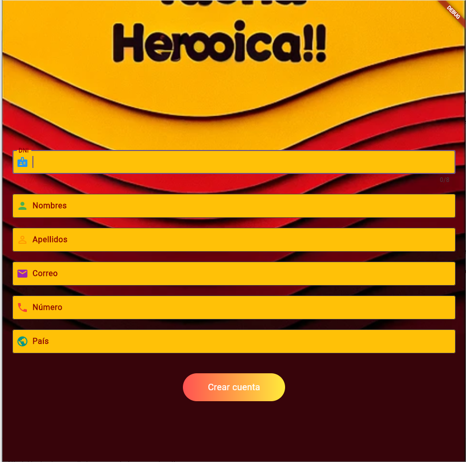

# SM2_EXAMEN_PRACTICO

## Descripción del Proyecto

Este proyecto es una **App turistica autogestionable con cotizaciones personalizadas** que permite a los usuarios **averiguar mas sobre donde piensan viajar y cotizar un itinerario**. Las funcionalidades implementadas son las siguientes:

1. **Historia 1: Registro de usuario**: Permite al usuario, en este caso turista, registrarse en nuestra app para poder hacer uso de nuestros servicios
2. **Historia 2: Barra de navegación**: Permite al usuario poder navegar estre las distintas secciones e una manera mas comoda

---

## Historias Implementadas

### Historia 1: Registro de usuario

- **Descripción de la Historia**: Como usuario, quiero poder **registrarme**, para poder **hacer uso de los servicios de la app**.

**Ejemplo:**

**Historia 1**: Como usuario, quiero poder registrarme en la app para poder conocer mas sobre la ciudad y poder hacer uso de la IA en cotizaciones y tener una idea de cuanto necesito o seria mi itinerario

- **Implementación**: Usamos los campos necesarios que requerimos para poder tener un buen manejo de los datos para poder generar un buen soporte, haciendo uso de textbox y conexion a nuestra API para guardarlo
  
- **Captura de Pantalla**:  
   
   

---

### Historia 2: Barra de navegación

- **Descripción de la Historia**: Como usuario, quiero poder tener una interfaz intuitiva y que me facilite el manejo de la app

- **Implementación**: Usamos las herramientas clasicas de flutter para poder poner una barra de navegacion en la parte inferior para mayor comodidad con las secciones que se veran en la imagen
- **Captura de Pantalla**:  
   

---

---

## Enlace al Repositorio

Puedes acceder al repositorio del proyecto en GitHub en el siguiente enlace:

[https://github.com/anthonycs4/SM2_EXAMEN_PRACTICO.git)

